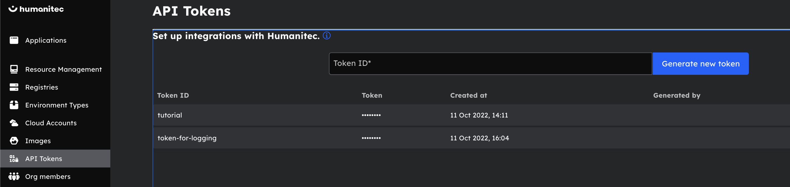

# Helm to Score Tutorial

## Repository

This repository contains everything needed to run this tutorial. You can find the code for container service used in this tutorial [here](https://github.com/humanitec/sample-score-app). You do not need to build this to run the tutorial.

## **Introduction**

Helm gives you the ability to template and package your Kubernetes manifests, but it doesn’t solve the following issues for you:

- Define and provision dependent workload resources
- Configuration sprawl across environments.

Using Score with Humanitec can help solve those issues by enabling Dynamic Configuration Management for your team using a simple workload specification.

## **Overview**

In this tutorial, we will show how to convert your workload-scoped Helm charts to Score to be used with Humanitec. We will also show you how to apply the score file in Humanitec. You can do this tutorial with our trial account. 

## **Prerequisites**

Before starting this tutorial, you’ll need:

- [A Humanitec account](https://app.humanitec.io/) (if you don’t have an account yet, explore the full functionality of Humanitec and test it free for 45 days)
- [score-humanitec](https://docs.score.dev/docs/get-started/install/) installed on your computer.
- A POSIX-Compliant Bash terminal (otherwise, you may need to slightly change the commands below)
- [curl](https://curl.se/)
- [jq](https://stedolan.github.io/jq/)

## Helm Chart

We will convert this simple Helm Chart to Score to deploy to Humanitec. You can find the repository for this chat [here](./helm-chart/templates/helloworld.yaml)

```yaml
apiVersion: v1
kind: Secret
metadata:
  name: db-credentials
type: Opaque
data:
  username: {{ .Values.db.username | b64enc | quote }}
  password: {{ .Values.db.password | b64enc | quote }}
---
apiVersion: apps/v1
kind: Deployment
metadata:
  name: hello-world-deployment
  labels:
    app: hello-world
spec:
  replicas: 1
  selector:
    matchLabels:
      app: hello-world
  template:
    metadata:
      labels:
        app: hello-world
    spec:
      containers:
      - name: hello-world
        image: {{ .Values.image.repository }}:{{ .Values.image.tag }}
        env:
        - name: PORT
          value: "3000"
        - name: DB_DATABASE
          value: {{ .Values.db.name }}
        - name: DB_USER
          valueFrom:
            secretKeyRef:
              name: db-credentials
              key: username
        - name: DB_PASSWORD
          valueFrom:
            secretKeyRef:
              name: db-credentials
              key: password
        - name: DB_HOST
          value: {{ .Values.db.host }}
        - name: DB_PORT 
          value: {{ .Values.db.port | quote }}
        ports:
        - containerPort: 80
          protocol: TCP
---
apiVersion: v1
kind: Service
metadata:
  name: hello-world-svc
spec:
  type: ClusterIP
  selector:
    app: hello-world
  ports:
    - port: 80
      targetPort: 3000
---
apiVersion: networking.k8s.io/v1
kind: Ingress
metadata:
  name: ingress-hello-world
spec:
  rules:
  - http:
      paths:
      - path: /
        pathType: Prefix
        backend:
          service:
            name: hello-world-svc
            port:
              number: 80
  ingressClassName: nginx
```

Multiple development teams can use this workload-scoped Helm template by changing the values to suit their needs. However, there are a few challenges that Helm does not solve for you:

- Helm will not provision the database resource this workload requires; a developer will need to do it separately with a terraform template or any other method, or an operations team will need to do it and then pass the configuration over.
- The developer needs to provide configuration values for the workload; these values may be easy to fetch, or they may need to contact an operations team and wait.
- Each environment will need its own values file.
- Secrets must be handled carefully so they don’t end up in a repository or somewhere unsafe.
- The Helm template is somewhat fixed; changing it can be a tedious process

## Score Files

The above Helm template and accompanying values file for all environments can be translated into the following Score file:

```yaml
apiVersion: score.dev/v1b1

metadata:
  name: hello-world

# Define the ports that this service exposes
service:
  ports:
    www:
      port: 80 # The port that the service will be exposed on
      targetPort: 3000 # The port that the container will be listening on

containers:
  frontend:
    image: registry.humanitec.io/public/sample-score-app:latest
    variables:
      PORT: "3000"
      DB_DATABASE: ${resources.db.name}
      DB_USER: ${resources.db.username}
      DB_PASSWORD: ${resources.db.password}
      DB_HOST: ${resources.db.host}
      DB_PORT: ${resources.db.port}

# Define the resources that this service needs
resources:
  dns: # We need a DNS record to point to the service 
    type: dns
  db:  # We need a database to store data
    type: postgres
    properties:
      name:
      username:
      password:
      host:
      port:
```

```yaml
apiVersion: humanitec.org/v1b1

# Humanitec specific metadata
# In this case we are defining the ingress rules for the service
spec:
  ingress:
    rules:
      "${resources.dns}": # This is the DNS record that we defined in the resources section
        http:
          "/":
            type: prefix
            port: 80
```

Using Score with Humanitec bestows the following advantages:

- Resources specified (the database) are automatically provisioned based on [Resource Definitions](https://docs.humanitec.com/reference/concepts/resources/definitions) platform engineers define in Humanitec.
- The configuration values are automatically injected into the workload from the resources and environment criteria using [placeholders](https://docs.humanitec.com/reference/concepts/app-config/placeholders)
- One config file for all environments. Humanitec automatically infers environment configuration and resources based on [matching criteria](https://docs.humanitec.com/reference/concepts/resources/definitions#resource-context).
- Secrets don’t need to be handled; they are safely placed in a secret store and injected into the workload at deployment time.
- Template and configuration are one.

## Applying the Score File

You can follow this tutorial by creating a [A Humanitec account](https://app.humanitec.io/) 

### Step 1: **Clone this repository**

```bash
git clone https://github.com/humanitec-tutorials/helm-to-score-tutorial.git ; cd helm-to-score-tutorial
```

### **Step 2: Populate config values**

Populate the Humanitec configuration variables for your deployment; these environment variables will be used in all the commands that interact with Humanitec in your shell.

```bash
export HUMANITEC_APP="helm-to-score-tutorial"
```

```bash
export HUMANITEC_TOKEN="enter your Humanitec token here"
```

```bash
export HUMANITEC_ORG="enter your Humanitec org here"
```

To get the Humanitec Token, go into the UI and click on the API Tokens menu:



The organization name will be named when you create your Humanitec account; you can find it at the bottom left corner of the screen:

 


And you can also find it in the URL:


The app you can populate it with any name you want; we will create it in the next step

### **Step 3: Create a Humanitec App**

[Apps](https://docs.humanitec.com/using-humanitec/work-with-apps) are how Humanitec groups your [Workloads](https://docs.humanitec.com/using-humanitec/work-with-workloads). If you have multiple Workloads that need to interact with one another, it makes sense to deploy them within the same app. An App would typically be created by a platform engineer and handed down to a developer to work with, but in our demo environment, we will create it ourselves.

Create a Humanitec App:

```bash
curl -sw '%{http_code}' \
--request POST "https://api.humanitec.io/orgs/${HUMANITEC_ORG}/apps" \
--header "Authorization: Bearer ${HUMANITEC_TOKEN}" \
--header "Content-Type: application/json" \
--data-raw '{
  "id": "'"${HUMANITEC_APP}"'",
  "name": "'"${HUMANITEC_APP}"'"
}' | jq
```

Your output will look like this:

```json
{
  "id": "helm-to-score-tutorial",
  "name": "helm-to-score-tutorial",
  "created_at": "2023-03-17T09:10:52.663605287Z",
  "created_by": "s-781798f9-e2e6-456e-814c-768ea737ebc6",
  "envs": [
    {
      "id": "development",
      "name": "Development",
      "type": "development"
    }
  ]
}
201
```

### **Step 4: Deploy your Score File**

```bash
score-humanitec delta --env development --app $HUMANITEC_APP --org="${HUMANITEC_ORG}" --token "${HUMANITEC_TOKEN}" --deploy
```

Your output will look like this:

```json
{
  "id": "0c925555212e33dec9ede775801109b3a0994cac",
  "metadata": {
    "env_id": "development",
    "name": "Auto-generated (SCORE)",
    "url": "https://app.humanitec.io/orgs/happy-learning/apps/helm-to-score-tutorial/envs/development/draft/0c925555212e33dec9ede775801109b3a0994cac",
    "created_by": "s-781798f9-e2e6-456e-814c-768ea737ebc6",
    "created_at": "2023-03-14T17:31:44.835480698Z",
    "last_modified_at": "2023-03-14T17:31:44.835480698Z"
  },
  "modules": {
    "add": {
      "hello-world": {
        "externals": {
          "db": {
            "type": "postgres"
          },
          "dns": {
            "type": "dns"
          }
        },
        "profile": "humanitec/default-module",
        "spec": {
          "containers": {
            "frontend": {
              "id": "frontend",
              "image": "registry.humanitec.io/public/sample-score-app:latest",
              "variables": {
                "DB_DATABASE": "${externals.db.name}",
                "DB_HOST": "${externals.db.host}",
                "DB_PASSWORD": "${externals.db.password}",
                "DB_PORT": "${externals.db.port}",
                "DB_USER": "${externals.db.username}",
                "PORT": "3000"
              }
            }
          },
          "ingress": {
            "rules": {
              "externals.dns": {
                "http": {
                  "/": {
                    "port": 80,
                    "type": "prefix"
                  }
                }
              }
            }
          },
          "service": {
            "ports": {
              "www": {
                "container_port": 3000,
                "protocol": "TCP",
                "service_port": 80
              }
            }
          }
        }
      }
    }
  }
}
```

### **Step 5: Verify Deployment**

Go to the [Humanitec UI](https://app.humanitec.io) and select the application you just created:

Going into the Humanitec console, you can see the result and access the ingress.


Click on the active deployment and the hello-world workload:


You will see the log output and the placeholders providing the values:


Copy the ingress address:


When you paste it on your browser you will see this:


### **Step 5: Clean up**

This command will delete the app you created, in case you want to start over from step 3:

```bash
curl -sw '%{http_code}' \
--request DELETE "https://api.humanitec.io/orgs/${HUMANITEC_ORG}/apps/$HUMANITEC_APP" \
--header "Authorization: Bearer ${HUMANITEC_TOKEN}" \
--header "Content-Type: application/json" \
| jq
```

## Learn More

* [Humanitec Score Tutorial](https://humanitec.com/blog/deploy-a-workload-with-score-and-humanitec)